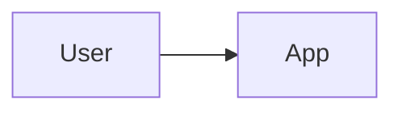

# Architecture — <project-name>

The system map an agent needs when entering this repo cold. Keep it current — post-merge
obligations (ADR-0001 §8) include updating this when components/flows change.

## Components
<!-- TODO(setup): list the moving parts (services, workers, UIs, schedulers) — one line each:
     name, responsibility, where it runs. -->

## Data flow
<!-- TODO(setup): the 2-5 flows that explain the system, as arrows:
     e.g. "user action → API → queue → worker → external API → DB". -->

## External dependencies (with reversibility class)
<!-- TODO(setup): every external system this repo touches, each classified:
     REVERSIBLE (bad call = retry/revert) vs IRREVERSIBLE/EXISTENTIAL (quota, tokens, user-visible
     sends) — irreversible ones MUST have rate-limit/breaker confinement (ADR-0001 §2). -->

## Where to look first
<!-- TODO(setup): top 3 entry-point files for understanding + top 3 for debugging. -->

## Diagram (recommended)
A mermaid diagram makes the map agent-parseable AND renderable. Keep the syntax-guard comment —
it prevents agents from generating unrenderable variants (convention from task-dag):

## Component inventory (for repos with many moving parts)
Optional table (convention from sharingan — excellent for script fleets): one row per component:
`ID | area | responsibilities | consumed-by`. The consumed-by column ("imported by N scripts:
...") is the high-value part — it makes blast-radius visible before a change.
